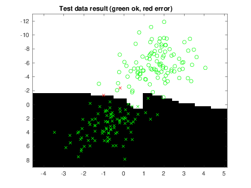
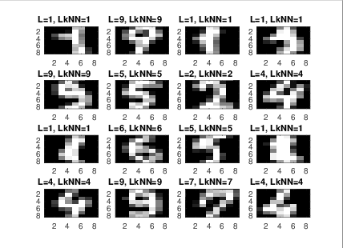

# Assignment 1 - Supervised learning: kNN and Backpropagation


## Overview of the data 
	
Looking at the data from a machine learning perspective we can observe how the data is compressed from 32x32 bitmap images to 64 features with the integer range 0..16. This means that we can create a hypercube feature space with 64 dimensions. This is a significantly dimensionally reduced feature space compared to 32x32 binary dimensions.

The pre processing of the data doesn't only reduce the number of dimensions, it also reduces the variance in small distortions.

## Implementation of the kNN algorithm

### kNN without cross-validation

The implementation of kNN is fairly straight forward. 

We iterate though all the cases in the test set and calculate the distance to each point in the training set. The result is then sorted in ascending order and the `k` first elements are counted in regards to what label they are assigned. The label with the most values are then picked to be assigned for the testing case we are currently processing. When no counted label is higher than another we pick the label with the data point which have the closest euclidean distance to the test case.

The result of our implementation of the kNN algorithm with k arbitrarily choose as 4 can be seen below.

Parameters: k = 4
Accuracy = 0.9710
```
cM =

    99     0     0     0     0     0     0     0     0     0
     0    97     1     0     0     0     0     0     2     3
     0     0    97     0     0     0     0     0     0     1
     0     1     0    98     0     0     0     0     0     3
     0     1     0     0    96     0     0     0     0     2
     0     0     0     1     0   100     0     0     0     1
     1     0     0     0     0     0   100     0     0     0
     0     0     2     0     0     0     0   100     0     0
     0     1     0     0     1     0     0     0    96     2
     0     0     0     1     3     0     0     0     2    88
```


### kNN with n-fold cross validation

For the cross validation version the n-fold cross validation algorithm was used to determine the best value for k. For all of the following results a n of 2 was used but he algorithm implementation allow for any value of n as long as it can evenly distribute the data set. Accuracy is used as the validation score in order to find the best value for k.


#### Data set 1


Best parameters: k = 1
Accuracy = 0.9900



#### Data set 2


Best parameters: k = 1
Accuracy  = 1


#### Data set 3


Best parameters: k = 1
Accuracy  = 1


#### Data set 4


Best parameters: k = 1
Accuracy = 0.9840





## Single layer backpropagation

The implementation of the single layer backpropagation algorithm we use a linear activation function and the gradient $\frac{n}{s}(Y-Dt)*Xt^t$ where $n$ is the number of case, $Y$ is the result from the forward propagation, $Dt$ is the expected value for $Y$ and $Xt$ is a matrix with all training features-

#### Results single layer network

#### Data set 1

This is not a large feature space meaning we don't need huge precision in our weights.

Iterations = 800
learning rate = 0.005
Accuracy = 0.9950


#### Data set 2

For this data set we require much more precision which is why we have bumped up the number of iterations and reduced the learning rate.

Iterations = 200000
learning rate = 0.00005
Accuracy = 0.8200


#### Data set 3

These parameters should work just fine for this data set as well since we are classifying something that is similar to the last data set.

Iterations = 200000
learning rate = 0.00005
Accuracy = 0.8533


### Data set 4

This data set is much more complex compared to the other three but we are still dealing with the same number of neurons. 

Iterations = 200000
learning rate = 0.00005
Accuracy = 0.9160


## Multilayer backpropagation

For the multilayer version we will be using one hidden layer with non-linear activation function (hyperbolic tangent) and one output layer with the same specifications as before. 

We have two gradients we need to calculate, for the output layer and for the hidden layer.

Gradient for the output layer: $\frac{2}{n}(Y - Dt) * H^t$ where $Y$, $Dt$, and $n$ is the same as before. $H$ is our matrix of outputs from the hidden layer during the forward propagation phase.

The gradient for the hidden layer is a bit more complicated: $\frac{2}{n}((V^t(Y-Dt)).*tanh'(H))* Xt^t$ where $V$ is our weight matrix for our output layer and  $Xt$ is the feature matrix of our testing data.

### Results multilayer network

#### Data set 1

This is not a large feature space meaning we don't need huge precision in our weights.

Hidden neurons = 5
Iterations = 2000
learning rate = 0.01
Accuracy = 0.9950


#### Data set 2

For this data set we require much more precision which is why we have bumped up the number of iterations and reduced the learning rate.

Hidden neurons = 2
Iterations = 30000
learning rate = 0.005
Accuracy = 1


#### Data set 3

These parameters should work just fine for this data set as well since we are classifying something that is similar to the last data set.

Hidden neurons = 10
Iterations = 4000
learning rate = 0.005
Accuracy = 0.9967


### Data set 4

This data set is much more complex compared to the other three but we are still dealing with the same number of neurons. 

Hidden neurons = 640
Iterations = 400000
learning rate =  0.001
Accuracy = 0.9150


##


* A short summary of your backprop network implementation (single + multi)
* Present the result from the backprop training and how you reached the accuracy criteria for each dataset. Motivate your choice of network for each dataset, then explain how you selected good values for the learning rate
* Present the result, including images, of your example for a non-generalisable backprop solution. Explain why this example is non-generalisable
* A final discussion and conclusion where you explain the difference between the performance of the different classifiers, Pros and cons etc.

